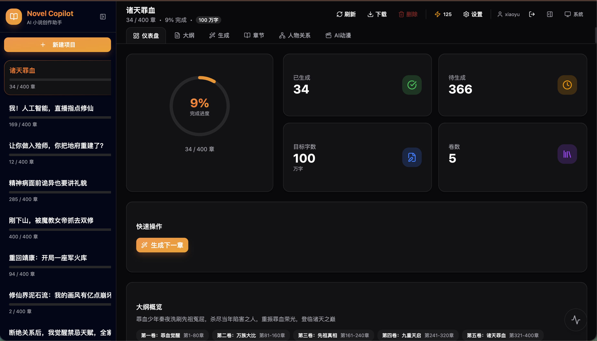
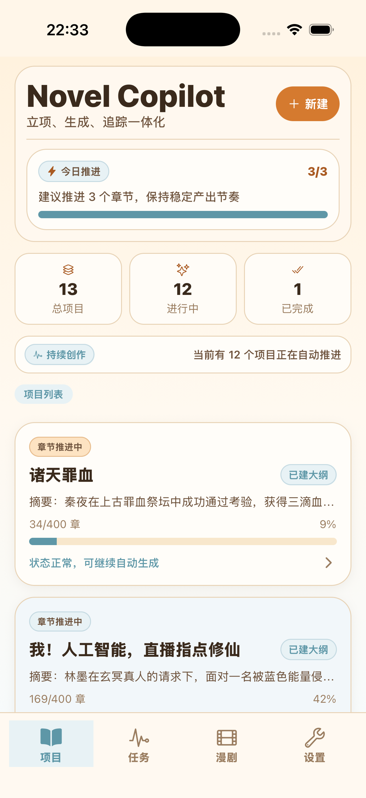

# Novel Copilot

A full-stack AI novel creation platform powered by Cloudflare Workers, with both Web and React Native App clients.

[中文文档](./README.zh.md)

[](https://deploy.workers.cloudflare.com/?url=https://github.com/doctoroyy/novel-copilot)

## Product Screenshots

### Web Home

<p>
  
</p>

### App Screens

<p>
  
  
  
</p>

## Features

### Writing Workflow

- Multi-provider model support (Gemini, OpenAI, DeepSeek, custom provider headers)
- Story Bible generation and editing
- Outline generation and refinement (SSE stream)
- Single chapter generation (SSE stream)
- Batch chapter generation (persistent background task)
- Chapter reading, copying, and ZIP export
- Character relationship graph and context-aware writing

### Context Engineering + QC

| Layer/Phase | Module | Purpose |
|---|---|---|
| Base | Story Bible | World, rules, setting, constraints |
| Base | Rolling Summary | Compressed running summary |
| Base | Recent Chapters | Style and continuity anchoring |
| Phase 1 | Character State | Character status snapshots |
| Phase 2 | Plot Graph | Foreshadowing and dependency graph |
| Phase 3 | Narrative Control | Pacing and narrative arc guidance |
| Phase 4 | Multi-dimensional QC | Consistency, pacing, goal checks |
| Phase 5 | Semantic Cache | Context reuse and optimization |
| Phase 6 | Timeline Tracking | Event deduplication and chronology |

### Task System (Important)

- Task persistence in `generation_tasks`
- Global active task endpoint: `/api/active-tasks`
- Project active task endpoint: `/api/projects/:projectRef/active-task`
- Preferred cancel endpoint: `/api/tasks/:id/cancel`
- Web: SSE-based synchronization
- App: polling synchronization with lower frequency

## Architecture
[](https://deepwiki.com/doctoroyy/novel-copilot)
```text
novel-copilot/
├── src/                                  # Cloudflare Worker backend
│   ├── worker.ts                         # app entry and route mounting
│   ├── middleware/
│   │   └── authMiddleware.ts             # JWT auth + optional auth
│   ├── routes/
│   │   ├── auth.ts                       # login/register/google auth
│   │   ├── projects.ts                   # project/chapter CRUD + download
│   │   ├── generation.ts                 # outline/chapter generation (SSE + task)
│   │   ├── tasks.ts                      # active-task/cancel/pause/delete
│   │   ├── editing.ts                    # chapter editing related APIs
│   │   ├── characters.ts                 # relationship graph APIs
│   │   ├── context.ts                    # context engineering APIs
│   │   ├── anime.ts                      # anime pipeline APIs
│   │   ├── admin.ts                      # admin model feature controls
│   │   ├── credit.ts                     # credit APIs
│   │   └── config.ts                     # runtime configs
│   ├── services/
│   │   ├── aiClient.ts                   # provider abstraction
│   │   ├── configManager.ts              # dynamic model config
│   │   ├── creditService.ts              # credit consume logic
│   │   ├── imageGen.ts                   # image generation
│   │   ├── veoClient.ts                  # video generation
│   │   └── voiceService.ts               # TTS
│   ├── context/
│   │   ├── characterStateManager.ts
│   │   ├── plotManager.ts
│   │   ├── semanticCache.ts
│   │   └── timelineManager.ts
│   ├── narrative/
│   │   └── pacingController.ts
│   ├── qc/
│   │   ├── multiDimensionalQC.ts
│   │   ├── characterConsistencyCheck.ts
│   │   ├── pacingCheck.ts
│   │   ├── goalCheck.ts
│   │   └── repairLoop.ts
│   ├── db/
│   │   ├── schema.sql
│   │   └── anime-schema.sql
│   └── worker.ts
├── web/                                  # React Web app
│   ├── src/components/
│   │   ├── layout/                       # header/sidebar/activity panel
│   │   ├── views/                        # dashboard/outline/generate/chapters/...
│   │   └── ui/                           # shared UI primitives
│   ├── src/contexts/                     # auth/project/generation/server-events
│   ├── src/pages/                        # route pages
│   └── src/layouts/                      # project layout
├── mobile/                               # Expo React Native app
│   ├── src/navigation/                   # root stack + tabs + project stack
│   ├── src/screens/                      # auth/projects/activity/anime/settings/admin
│   ├── src/contexts/                     # auth + app config
│   ├── src/hooks/                        # active task polling
│   ├── src/lib/                          # API client + storage + constants
│   └── src/types/                        # domain/navigation types
├── migrations/                           # D1 migrations
├── scripts/
│   ├── ios-package.sh                    # local iOS packaging script
│   └── android-enable-abi-splits.sh      # ABI split patch for Android CI build
├── docs/
│   ├── mobile-ci.md                      # CI packaging docs
│   └── images/                           # README screenshots
├── .github/workflows/
│   └── build-mobile-packages.yml         # mobile build + release publishing
├── package.json
├── wrangler.toml
└── README.zh.md
```

## Routing and IDs

- Web routes now use `projectId` by default:
  - `/project/:projectId/dashboard`
  - `/project/:projectId/outline`
  - `/project/:projectId/generate`
  - `/project/:projectId/chapters`
- Mobile navigation uses `projectId` in route params.
- Backend `projectRef` supports both `id` and `name` for backward compatibility, but new clients should always send `id`.

## Local Development

### Prerequisites

- Node.js 22+
- pnpm 9+
- Cloudflare account (for deployment)

### Install

```bash
pnpm install
pnpm -C web install
pnpm -C mobile install
```

### Database (local)

```bash
pnpm db:migrate:local
```

### Run backend

```bash
pnpm dev
```

Backend runs at `http://localhost:8787`.

### Run web

```bash
pnpm -C web dev
```

Web runs at `http://localhost:5173`.

### Run app

```bash
pnpm dev:mobile
```

## Common Scripts

```bash
# type check
pnpm typecheck
pnpm mobile:typecheck

# web build
pnpm build:web

# db migration
pnpm db:migrate:local
pnpm db:migrate:remote

# deploy worker + web assets
pnpm deploy

# local iOS package
pnpm mobile:ios:package
pnpm mobile:ios:package:install
```

## Mobile Build CI and Release Assets

Workflow: `.github/workflows/build-mobile-packages.yml`

Build outputs (artifact names):

- `NovelCopilot-android-universal-apk`
- `NovelCopilot-android-arm64-apk`
- `NovelCopilot-ios-ipa`

Released asset file names:

- `NovelCopilot-android-universal.apk`
- `NovelCopilot-android-arm64-v8a.apk`
- `NovelCopilot-ios.ipa`

The workflow also auto-publishes to a rolling GitHub pre-release:

- Tag: `mobile-builds`
- Release name: `NovelCopilot Mobile Builds`

### iOS Secrets

Required repository secrets:

- `IOS_CERT_BASE64`
- `IOS_CERT_PASSWORD`
- `IOS_PROVISION_PROFILE_BASE64`
- `IOS_TEAM_ID`
- `IOS_KEYCHAIN_PASSWORD`

Optional:

- `IOS_BUNDLE_ID`
- `IOS_EXPORT_METHOD`
- `IOS_CODE_SIGN_IDENTITY`

More details: `./docs/mobile-ci.md`

## Deployment (Cloudflare)

```bash
# create D1
npx wrangler d1 create novel-copilot-db

# optional: create R2 for anime/video
npx wrangler r2 bucket create novel-copilot-videos

# initialize schema
pnpm db:init

# deploy
pnpm deploy
```

## Database Tables (Core)

| Table | Description |
|---|---|
| `projects` | project metadata and bible |
| `states` | next chapter index, rolling summary, open loops |
| `chapters` | chapter content |
| `outlines` | outline JSON |
| `characters` | relationship graph data |
| `generation_tasks` | background generation tasks |
| `chapter_qc` | QC results |
| `users` | auth users and permissions |

## License

MIT
